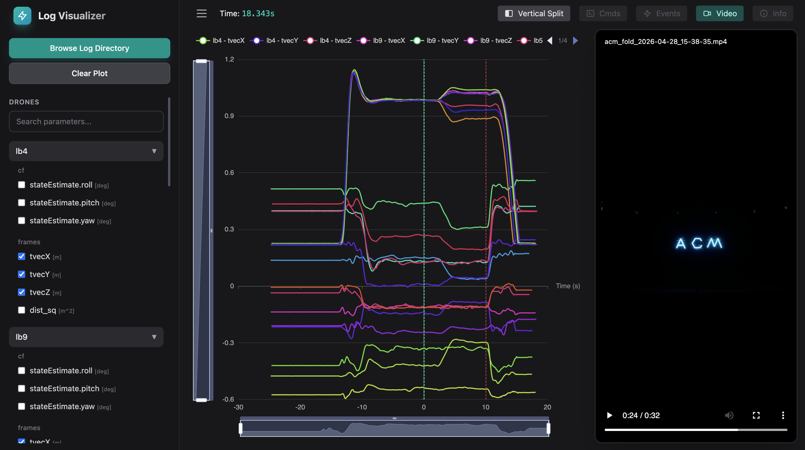

# LightBender Log Visualizer

## Overview

This project is a web-based tool for visualizing flight log data from the LightBender drone swarm. It allows users to plot sensor data, view video feeds, and analyze flight performance.



## Features

- **Interactive Plotting**: View and analyze drone telemetry data with dynamic zooming and panning
- **Video Visualization**: Synchronized video playback with corresponding telemetry data
- **Multi-Drone Support**: Visualize data from multiple drones simultaneously
- **Command/Event Overlay**: Mark and inspect command executions and events on the timeline
- **Parameter Selection**: Flexible sidebar for selecting specific parameters to plot

## Prerequisites

- **Node.js**: v18 or higher
- **npm**: v9 or higher

## Installation

1.  **Clone the repository**
    ```bash
    git clone https://github.com/flslab/fls-cf-log-visualizer.git
    cd fls-cf-log-visualizer
    ```

2.  **Install JavaScript dependencies**
    ```bash
    npm install
    ```

## Usage

### 1. Start the Vue Development Server

Open a new terminal, navigate to the `fls-cf-log-visualizer` directory, and run:

```bash
npm run dev
```

This will start the development server and open the application in your browser (usually at `http://localhost:5173`).

### 3. Use the Application

- **Browse Data**: Use the file explorer in the sidebar to browse the drone data
- **Select Parameters**: In the sidebar, choose the drones and parameters you want to visualize
- **View Video**: Click the "Video" button in the navbar to open the video player
- **Analyze Data**: Use the scroll wheel or drag the zoom area in the plot to explore the data
- **Inspect Events and Commands**: Use the buttons in the navbar to show/hide events and commands on the plot

## Development

This project uses:

- **Vue 3** with `<script setup>`
- **ECharts** for plotting
- **Pinia** for state management (though currently using a simple `store.js` file)
- **Tailwind CSS** for styling

